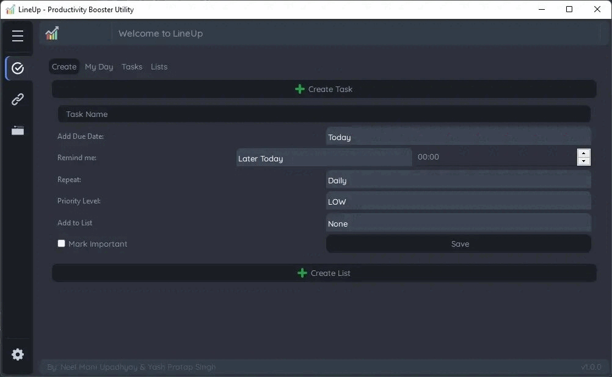

# Project Title: LineUp - Productivity Booster Utility
LineUp is a powerful productivity booster utility designed to help users streamline their daily tasks, manage references efficiently, and accelerate their workflow with customizable hotkeys. This multifunctional tool combines task scheduling, link reference storage, and hotkey management into a single, user-friendly application, providing a comprehensive solution to enhance productivity.

## Preview:

## Key Features:

#### 1. **Task Scheduling:**
   - LineUp allows users to create, manage, and prioritize tasks with ease. Users can set due dates, reminders, and task descriptions.
   - Tasks are displayed in a user-friendly, customizable interface, enabling users to stay organized and focused on their daily goals.

#### 2. **Reference Management:**
   - Users can save and organize web links, documents, and notes as references within LineUp. This feature serves as a centralized repository for important information.
   - References can be tagged, categorized, and searched for quick retrieval, eliminating the need to sift through bookmarks or documents.

#### 3. **Customizable Hotkeys:**
   - LineUp empowers users to assign and manage custom hotkeys for various actions within the application and even for external applications.
   - Hotkeys can be configured to trigger specific tasks, open references, or perform actions like taking screenshots or copying text, saving valuable time and effort.

#### 4. **Intuitive User Interface:**
   - The user interface of LineUp is designed to be intuitive and user-friendly, ensuring that both novice and experienced users can easily navigate and utilize its features.
   - A clean, organized layout promotes a clutter-free workspace, reducing distractions.

#### 5. **Cross-Platform Compatibility:**
   - LineUp is accessible across multiple platforms, including Windows, macOS, and various Linux distributions, ensuring users can access their productivity tools from their preferred devices.

#### 6. **Data Security and Privacy:**
   - LineUp prioritizes the security and privacy of user data. All task lists, references, and hotkey configurations are stored securely and can be password-protected or encrypted if desired.

#### 7. **Cloud Integration (Future Enhancement):**
   - A potential future enhancement could include cloud integration, enabling users to synchronize their LineUp data across devices and access it from anywhere.

#### 8. **Advanced Analytics (Future Enhancement):**
   - Another potential future feature could involve advanced analytics that provide insights into task completion rates, time allocation, and productivity trends.

## Potential Use Cases:
- Professionals looking to optimize their workflow and time management.
- Students seeking a tool to manage assignments, research, and study materials efficiently.
- Content creators who want to streamline their content production process.
- Researchers and knowledge workers who need a centralized reference and note management solution.

LineUp aims to be the go-to productivity booster for individuals seeking a seamless and integrated solution for task management, reference organization, and hotkey automation. By combining these essential features into one utility, LineUp simplifies the user's digital workspace and enhances productivity, allowing them to accomplish more with less effort and stress.
